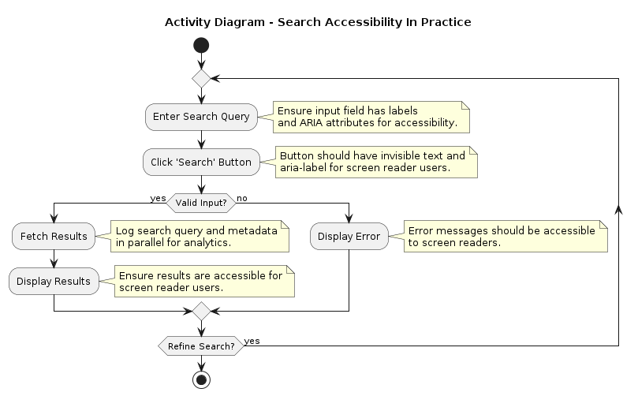
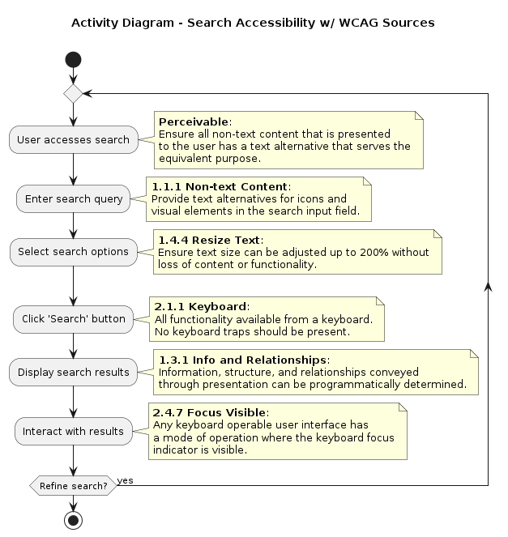

# eHealthy-2-docs
Docs repo for eHealthy app / vertical slice

Regarding WCAG the most effective thing, that introduces the least overhead, is probably to take an accessibility (a11y) perspective from start. w3 org has good documentation both about tools for analysis, and guidelines for setup and human evaluation: [https://www.w3.org/WAI/test-evaluate/](https://www.w3.org/WAI/test-evaluate/).

## Thoughts about the current site [vardgivarguiden.se](https://vardgivarguiden.se/)
### Search functionality
As I have noticed a central search function on vardgivarguiden.se, I have made a draft for an Activity Diagram to visualize the inclusion of WCAG practices and validation. Then there is another diagram which is created by feeding AI with the WCAG quick reference to get direct pointers from the search functionality details, to the WCAG quick reference.

Clickable link for WCAG quick reference:\
<a href="https://www.w3.org/WAI/WCAG22/quickref/" target="_blank">https://www.w3.org/WAI/WCAG22/quickref/</a>

